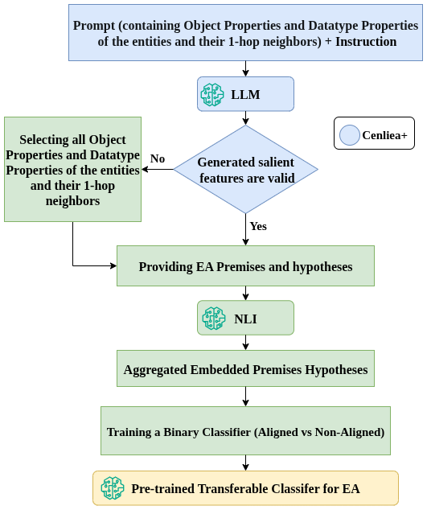

# Cenliea

## Cenliea: A Cross-Encoder NLI Framework Enhanced by LLM-Based Reasoning for Transferable, Domain-Agnostic Entity Alignment

Code Appendix for the Paper [Cenliea: A Cross-Encoder NLI Framework Enhanced by LLM-Based Reasoning for Transferable, Domain-Agnostic Entity Alignment](https://openreview.net/forum?id=v4Fnw1oySH) sumbitted for AAAI 2026.

This repository provides the complete codebase for **Cenliea** and **Cenliea+**, two complementary pipelines for entity alignment (EA) across heterogeneous knowledge graphs (KGs). The framework combines structured input encoding, multilingual NLI-based embeddings, and LLM-augmented reasoning to offer a generalizable, explainable alignment approach.

The **Cenliea** pipeline uses cross-encoder NLI embeddings to assess alignment between entity descriptions from heterogeneous KGs. It leverages the [mDeBERTa-v3-base-xnli](https://huggingface.co/MoritzLaurer/mDeBERTa-v3-base-xnli-multilingual-nli-2mil7) model to generate joint semantic entailment vectors from structured entity features.

**Cenliea+** extends this by prompting a large language model ([Mistral-7B](https://huggingface.co/mistralai/Mistral-7B-Instruct-v0.2)) to generate salient alignment hypotheses, which are then transformed into NLI inputs. The resulting embeddings are pooled and passed to a binary classifier to determine entity correspondence. 

---

## 🧭 Pipeline



## 📌 Overview

Cenliea introduces a neurosymbolic EA pipeline with the following core phases:
- 🧱 **Structured prompt construction** from RDF graphs
- 🧠 **NLI vectorization** for entity pair similarity estimation
- 📈 **Binary classifier training** for alignment detection
- 🔍 **Cenliea+ (optional)**: LLM-generated explanations augment difficult or low-confidence cases

---

## 🧱 Components

### [`dataset_preparation/`](./dataset_preparation)

- Converts RDF/XML files into structured JSON
- Extracts direct and one-hop features
- Computes GPT-token similarity for negative sampling
- Produces `.parquet` files for downstream NLI encoding

📖 See [`dataset_preparation/README.md`](./dataset_preparation/README.md)

---
### [`vectorization/`](./vectorization)

#### [`Cenliea/`](./vectorization/Cenliea)

- Phase 1 of Cenliea: Bidirectional NLI embeddings using [`MoritzLaurer/mDeBERTa-v3-base-xnli-multilingual-nli-2mil7`](https://huggingface.co/MoritzLaurer/mDeBERTa-v3-base-xnli-multilingual-nli-2mil7)
- Loads `.parquet` input datasets and outputs embeddings per pair
- Outputs are cached for reuse or fallback scenarios in Cenliea+

📖 See [`Cenliea/README.md`](./vectorization/Cenliea/README.md)

---

#### [`Cenliea_plus/`](./vectorization/Cenliea_plus)

- Optional Phase 2: LLM-based alignment justification using [`mistralai/Mistral-7B-Instruct-v0.2`](https://huggingface.co/mistralai/Mistral-7B-Instruct-v0.2)
- Generates premise-hypothesis pairs from structured features
- Uses NLI to vectorize LLM-generated hypotheses
- Automatically falls back to Phase 1 embeddings if LLM output is invalid

📖 See [`Cenliea_plus/README.md`](./vectorization/Cenliea_plus/README.md)

---

### [`ea_classifier/`](./ea_classifier)

- Train and test a lightweight binary classifier using NLI or NLI+LLM embeddings.
- Includes:
  - `hp_tuning_train_binary_classifier.py`: Performs hyperparameter tuning and saves the trained model as a `.pkl` file.
  - `test_binary_classifier.py`: Loads the saved model and evaluates it on a held-out test set.
- Outputs include trained classifiers and `.json` files containing macro/micro F1 scores and confusion matrices.

📖 See [`ea_classifier/README.md`](./ea_classifier/README.md)

---

## ⚙️ Setup

Each module contains its own `requirements.txt`.

For example, to set up the classifier:

```bash
cd ea_classifier
pip install -r requirements.txt
```

Make sure you are logged in to [Hugging Face Hub](https://huggingface.co/docs/huggingface_hub) to access HuggingFace models:

```python
from huggingface_hub import login
login()
```

---

## 📬 Contact

This repository is part of an anonymous submission. Please use the OpenReview discussion page for questions or feedback.
