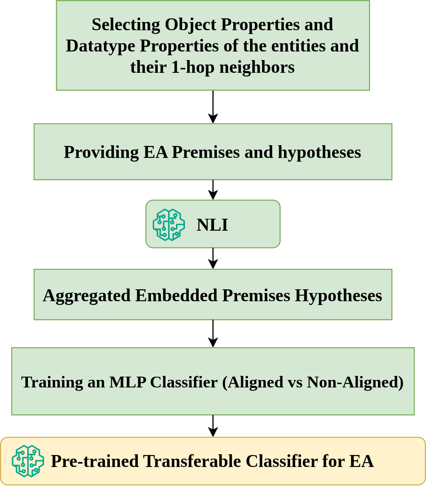
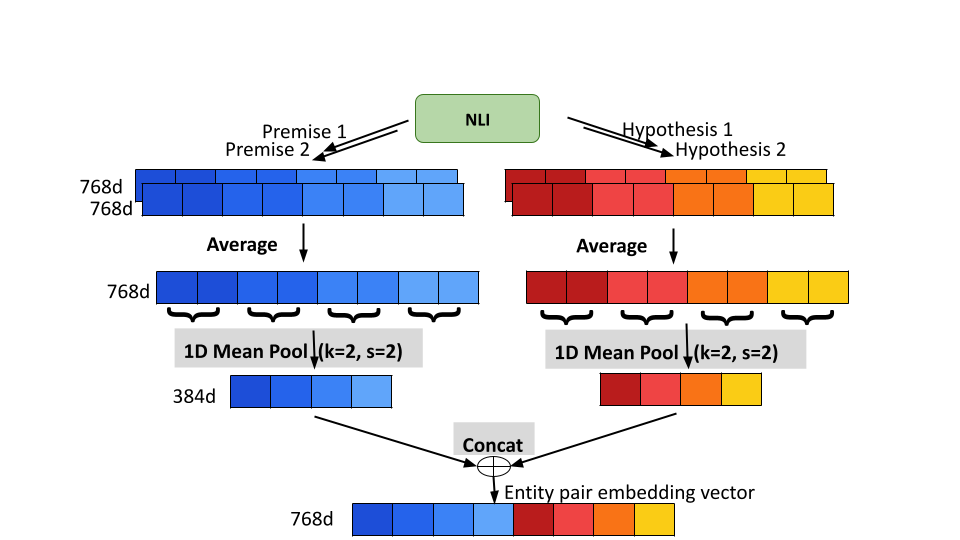

# Cenliea: A Cross-Encoder NLI Framework for Transferable, Domain-Agnostic Entity Alignment

Code Appendix for the Paper **Cenliea: A Cross-Encoder NLI Framework for Transferable, Domain-Agnostic Entity Alignment**.

This repository provides the complete codebase for **Cenliea**, a pipeline for entity alignment (EA) across heterogeneous knowledge graphs (KGs). The framework combines structured input encoding, multilingual NLI-based embeddings, and LLM-augmented reasoning to offer a generalizable, explainable alignment approach.

The **Cenliea** pipeline uses cross-encoder NLI embeddings to assess alignment between entity descriptions from heterogeneous KGs. It leverages the [mDeBERTa-v3-base-xnli](https://huggingface.co/MoritzLaurer/mDeBERTa-v3-base-xnli-multilingual-nli-2mil7) model to generate joint semantic entailment vectors from structured entity features.

---

## 🧭 Cenliea Pipeline



## 🧭 Embedding Procedure



## 📌 Overview

Cenliea introduces a neurosymbolic EA pipeline with the following core phases:
- 🧱 **Structured prompt construction** from RDF graphs
- 🧠 **NLI vectorization** for entity pair similarity estimation
- 📈 **Binary classifier training** for alignment detection

---

## 🧱 Components

### [1. `dataset_preparation/`](./dataset_preparation)

- Converts RDF/XML files into structured JSON
- Extracts direct and one-hop features
- Computes GPT-token similarity for negative sampling
- Produces `.parquet` files for downstream NLI encoding

📖 See [`dataset_preparation/README.md`](./dataset_preparation/README.md)

---
### [2. `vectorization/`](./vectorization)

#### [2.1. `Cenliea/`](./vectorization/Cenliea)

- Phase 1 of Cenliea: Bidirectional NLI embeddings using [`MoritzLaurer/mDeBERTa-v3-base-xnli-multilingual-nli-2mil7`](https://huggingface.co/MoritzLaurer/mDeBERTa-v3-base-xnli-multilingual-nli-2mil7)
- Loads `.parquet` input datasets and outputs embeddings per pair
- Outputs are cached for reuse or fallback scenarios in Cenliea+

📖 See [`Cenliea/README.md`](./vectorization/Cenliea/README.md)

---

### [3. `ea_classifier/`](./ea_classifier)

- Train and test a lightweight binary classifier using NLI or NLI+LLM embeddings.
- Includes:
  - `hp_tuning_train_binary_classifier.py`: Performs hyperparameter tuning and saves the trained model as a `.pkl` file.
  - `test_binary_classifier.py`: Loads the saved model and evaluates it on a held-out test set.
- Outputs include trained classifiers and `.json` files containing macro/micro F1 scores and confusion matrices.

📖 See [`ea_classifier/README.md`](./ea_classifier/README.md)

---

### [4. `pretrained_model/`](./pretrained_model)

- Contains a pretrained lightweight binary classifier trained on 768-D embeddings from **Cenliea** pipeline.
- Classifier is stored as `.pkl` files:
  - `CENLIEA_mlp.pkl`
  - `CENLIEA_SBP15kZhEn_finetuned_mlp.pkl` (A version of the **Cenliea MLP** fine-tuned using 10% of the ground-truth alignments from the unseen [**DBP15KZhEn**](https://github.com/nju-websoft/JAPE/tree/master/data) dataset.)
- These models can be directly applied to new datasets **without retraining**.

**To use:**
1. Prepare and vectorize a new dataset using:
   - [`dataset_preparation`](./dataset_preparation/)
   - [`vectorization/Cenliea`](./vectorization/Cenliea) or [`vectorization/Cenliea_plus`](./vectorization/Cenliea_plus)

2. Use the evaluation script in [`ea_classifier`](./ea_classifier) to test performance:
```bash
python test_binary_classifier.py \
  --dp path/to/your/vectorized.csv \
  --split test \
  --model_path pretrained_classifiers/best_sklearn_mlp_Cenliea.pkl \
  --output results_on_new_data.json
```

📖 See [`ea_classifier/README.md`](./ea_classifier/README.md) for argument details.

---

## ⚙️ Setup

Each module contains its own `requirements.txt`.

For example, to set up the classifier:

```bash
cd ea_classifier
pip install -r requirements.txt
```

Make sure you are logged in to [Hugging Face Hub](https://huggingface.co/docs/huggingface_hub) to access HuggingFace models:

```python
from huggingface_hub import login
login()
```

---

## 🧪 Reproducibility & Experimental Setup

- Binary classifiers are trained on 768-dimensional NLI embeddings produced by the [Cenliea](./cenliea/) and [Cenliea+](./cenliea_plus/) pipelines.
- Lightweight MLP architectures were tuned using `GridSearchCV` with 3-fold cross-validation, optimizing positive-class F1-score.
- Final models:
  - **Cenliea**: 64-16 MLP, ReLU activation, Optimizer: Adam, Initial learning rate = 0.001

## 💻 Runtime Environment

All experiments were run on **Google Colab Pro**:

- **Cenliea** used **NVIDIA L4 GPUs**

Average per-sample runtime:

| Pipeline   | Phase                        | Time / Sample |
|------------|------------------------------|----------------|
| Cenliea    | NLI Embedding                | 0.055 sec      |

---

## 📬 Contact

This repository is part of an anonymous submission. 
